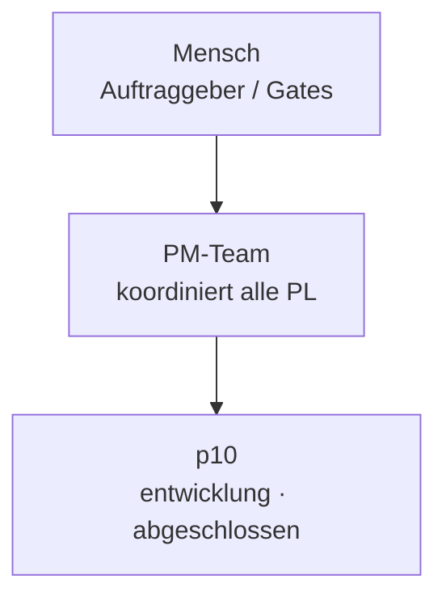

# Organigramm: p10

*Generiert aus den Registries (`process/teams/registry.yaml`, `process/roles/besetzungen.yaml`) durch `platform/scripts/organigramm.py` — **nicht von Hand pflegen**, Änderungen gehören in die Registry (Konzept `process/docs/03-rollenmodell-v2-orga-rework.md` Kap. 8).*

**Auftrag:** Aufgaben bearbeiten im HMI: Ticket-Editor für offene Tickets, freie Mehrfach-Labels mit Board-Filter, Typ setzen, Konflikterkennung gegen die Routine-Session

## Beteiligte

| Instanz | Rolle | Motor | Takt | Status | Hinweis |
|---|---|---|---|---|---|

Rollen-Bauplan: `process/roles/<rolle>.md` · projektspezifischer Teil: `roles/<rolle>.md` in diesem Repo · Historie: `docs/historie.md`
