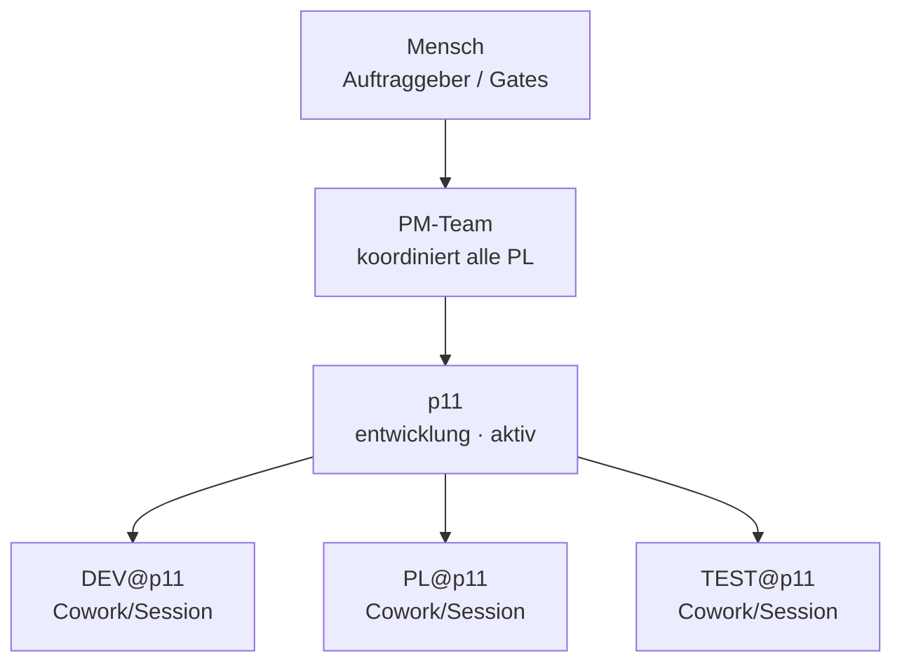

# Organigramm: p11

*Generiert aus den Registries (`process/teams/registry.yaml`, `process/roles/besetzungen.yaml`) durch `platform/scripts/organigramm.py` — **nicht von Hand pflegen**, Änderungen gehören in die Registry (Konzept `process/docs/03-rollenmodell-v2-orga-rework.md` Kap. 8).*

**Auftrag:** Widget-Dashboard: kompakte, nicht scrollbare Übersicht aller Projekte/Teams als konfigurierbare Widgets, Startseite + Detailseite je Projekt/Team, Mail-Widget hinter dem PIN-Lesegate

## Beteiligte

| Instanz | Rolle | Motor | Takt | Status | Hinweis |
|---|---|---|---|---|---|
| DEV@p11 | Entwickler | Cowork/Session | sprint | aktiv | — |
| PL@p11 | Projektleiter | Cowork/Session | sprint | aktiv | — |
| TEST@p11 | Verifikationsingenieur | Cowork/Session | sprint | aktiv | — |

Rollen-Bauplan: `process/roles/<rolle>.md` · projektspezifischer Teil: `roles/<rolle>.md` in diesem Repo · Historie: `docs/historie.md`
