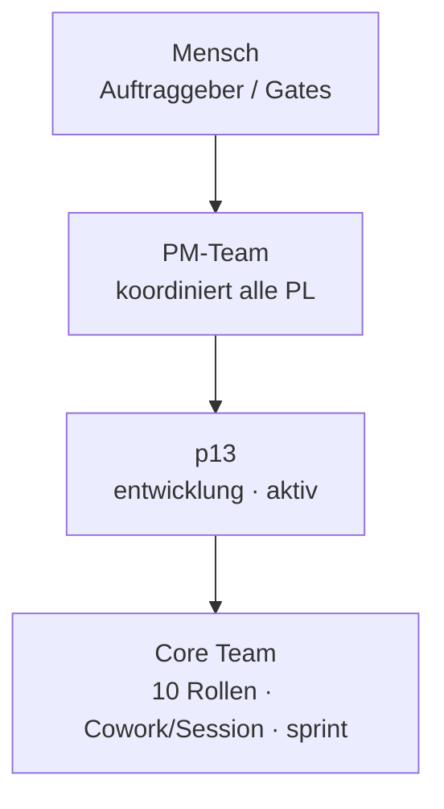

# Organigramm: p13

*Generiert aus den Registries (`process/teams/registry.yaml`, `process/roles/besetzungen.yaml`) durch `platform/scripts/organigramm.py` — **nicht von Hand pflegen**, Änderungen gehören in die Registry (Konzept `process/docs/03-rollenmodell-v2-orga-rework.md` Kap. 8).*

**Auftrag:** Produkt-Architekturbilder

## Beteiligte

| Instanz | Rolle | Motor | Takt | Status | Quelle | Hinweis |
|---|---|---|---|---|---|---|
| ARCH@p13 | Architekt | Cowork/Session | sprint | aktiv | Core Team (implizit) | — |
| CHG@p13 | Change-Manager | Cowork/Session | sprint | aktiv | Core Team (implizit) | — |
| CM@p13 | Konfigurationsmanager | Cowork/Session | sprint | aktiv | Core Team (implizit) | — |
| COACH@p13 | Prozess-Coach | Cowork/Session | sprint | aktiv | Core Team (implizit) | — |
| DEV@p13 | Entwickler | Cowork/Session | sprint | aktiv | Core Team (implizit) | — |
| PL@p13 | Projektleiter | Cowork/Session | sprint | aktiv | Core Team (implizit) | — |
| PROB@p13 | Problemmanager | Cowork/Session | sprint | aktiv | Core Team (implizit) | — |
| QM@p13 | Qualitätsmanager | Cowork/Session | sprint | aktiv | Core Team (implizit) | — |
| RM@p13 | Requirements-Manager | Cowork/Session | sprint | aktiv | Core Team (implizit) | — |
| TEST@p13 | Verifikationsingenieur | Cowork/Session | sprint | aktiv | Core Team (implizit) | — |

Rollen-Bauplan: `process/roles/<rolle>.md` · projektspezifischer Teil: `roles/<rolle>.md` in diesem Repo · Historie: `docs/historie.md`
